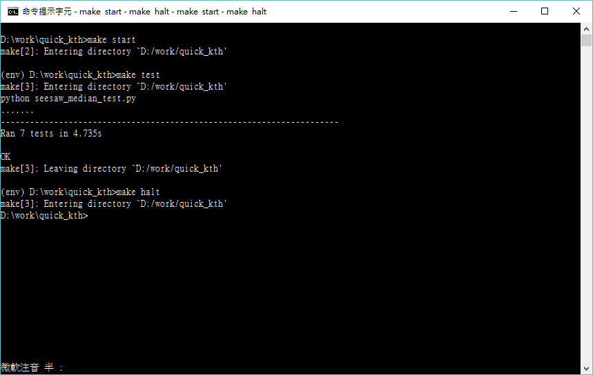

~~# quick_kth - Implementing of the Algorithm of some Sort-of Search~~
The old title was deprecated

# Seesaw Strategy Median Finding Algorithm

To find K-th number in a list of numbers. For the case of finding median, it's specific to find the N-th number in the number sequence with length of either 2N or 2N - 1.

### Technology
1. python
1. virtualenv
1. unittest

~~### quick_kth :: (List :: [Int]) -> (Len :: Int) -> (Kth :: Int) -> (N :: Int)~~
~~For a list `a` of length `len`, you may want to find k-th number `n`.~~

~~To find median of the list `a`, call `quick_kth(a, len, (len + 1) // 2)`.~~

~~Example #1: `quick_kth([1,2,3,4,5], 5, (5+1)//2)` gives `3` as the median.~~

~~Example #2: `quick_kth([1,2,3,4,5,6], 6, (6+1)//2)` gives `3, 4` as the median.~~

### Function Implemented

1. `seesaw_median(list1)` => `small, median, median1, big`

1. `seesaw_median_incre(small, median, median1, big, list1)` => `small, median, median1, big`

### Usage - to Run Unit Test
Run `make start` and `make test` to get results of unit test, then run `make halt` to exit python environment. The project is developed in Windows, so please make sure you have the `make` command in your system.

Add test cases into the folder `priv\test_data`*`.json`, one case per file.

### Screenshot

### Reference
The following document was consulted in development stage.

Complexity of Python Operations https://www.ics.uci.edu/~pattis/ICS-33/lectures/complexitypython.txt

